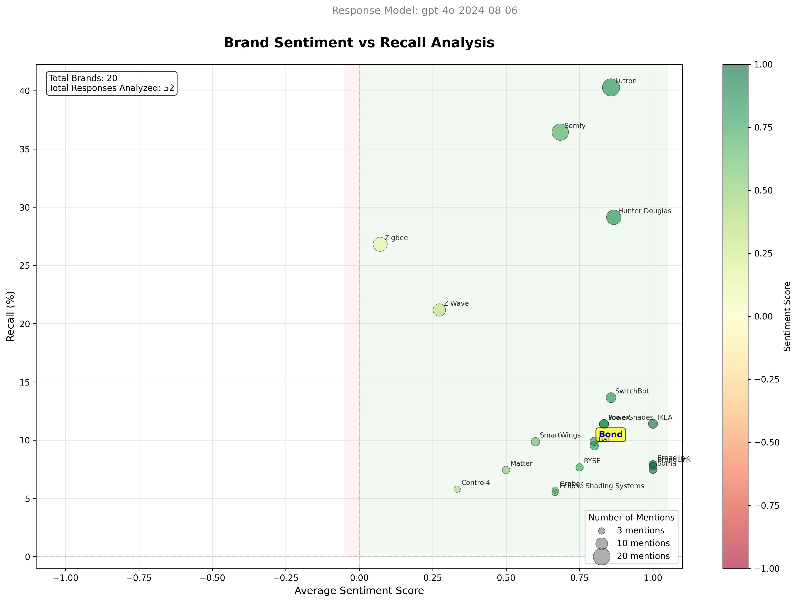

# BrandBench

Tracking brand knowledge and sentiment in AI chatbots.


## Business Purpose

Consumers are increasingly using chatbots in their purchasing journey.  ChatGPT is being used to discover solutions and products as well as to find product information pre- and post-sale.  It is in Olibra's interest to understand---and to the extent possible---to influence the information that chatbots provide to consumers so as to increase sales and ensure our brand is properly represented.

## Objective

At a high level, we seek to measure, on a recurring basis, the following:

 1. **Recall** -- How often does the chatbot suggest Bond relative to competing solutions?
 2. **Sentiment** -- Is the Bond brand presented in a positive, negative, or neutral way?
 3. **Accuracy** -- Is the information provided on Bond products accurate?

These metrics will allow us to measure any interventions we undertake, and we expect the details of the project to give us insight into what interventions will be most effective (for example, by discovering the specific search terms that the chatbots are using but have low brand recall).

For now, we focus solely on recall and sentiment. Accuracy is a broader subject to be taken up at a later date.

## Methodology

We simulate consumer interaction with chatbots by leveraging the OpenAI API access to the GPT-4o model, which very closely approximates results obtained when using ChatGPT.

We focus entirely on OpenAI's system as we expect the vast majority of consumer-chatbot interaction to be occurring on the ChatGPT product.

We construct a battery of short prompts that are typical of what prospective customers may type into ChatGPT and then use other AI models to judge the responses.

### Prompts

We test several categories of prompts:

#### Research Intent

Prompts where users are trying to solve a home automation problem:

 - How can I control my shades with Alexa?
 - How can I control Somfy shades?
 - Cloning RF remote controls.

#### Shopping Intent

Prompts that indicate a stronger purchase intent:

 - Compare prices on smart home hubs for shade control.
 - Best smart ceiling fans.
 - Are there alternatives to TaHoma?

#### Product Queries

In the future we may use FAQ-style questions to test accuracy of chatbot knowledge.  This will be focused on pre-sales questions that have an impact on the probability of purchase, however in the future we may wish to assess the chatbot's responses for unrealistic expectation setting and technical support post-sale.

 - Does Bond Bridge work with SAVANT?
 - Can Bond Bridge control Lutron shades?
 - Does Bond Bridge connect with Apple HomeKit?

### Intrinsic Knowledge vs Web Search

We will study both the intrinsic behavior of the model as well as the performance when a web search is performed.  We will focus more on the prompts that tend to generate web search tool calls as these results can be more readily intervened upon. Changing models' intrinsic knowledge requires a longer-term campaign of high-quality outbound content to get into the pre-training data. This has a 6--12 mo leadtime for current frontier models.

## Outcomes

This project will deliver:

 - graphs showing brand performance over time
 - specific search terms used by chatbots, highlighting those where Bond has poor performance
 - raw data available for re-processing at a later date
 




## Quick Start

### Prerequisites

1. **Python 3.8+** required

2. **Install dependencies:**
```bash
pip install -r requirements.txt
```

3. **Set your OpenAI API key:**
```bash
export OPENAI_API_KEY="your-api-key-here"
```

### Running BrandBench

BrandBench operates in three steps: **Execute → Analyze → Visualize**

#### Step 1: Execute Prompts

Generate AI responses to consumer queries about smart home automation:

```bash
# Quick start - test with web search enabled (recommended)
python test_prompt_executor.py --web-search

# Test without web search (uses model's intrinsic knowledge only)
python test_prompt_executor.py
```

**Options:**
- `--web-search`: Enable web search for more current information (recommended)
- `--num-prompts N`: Test only N prompts total (useful for testing)
- `--category NAME`: Test only a specific category (`ceiling_fans` or `shades`)
- `--prompt-file PATH`: Use custom prompt file (default: `prompts/prompts.yaml`)

**Examples:**
```bash
# Test 20 prompts from shades category with web search
python test_prompt_executor.py --category shades --num-prompts 20 --web-search

# Test all prompts
python test_prompt_executor.py --web-search
```

#### Step 2: Analyze Sentiment

Analyze brand sentiment in the generated responses:

```bash
# Analyze most recent results and create visualization
python analyze_existing_results.py --plot

# Analyze specific results file
python analyze_existing_results.py data/responses/20250722_143021_responses.json --plot
```

This will:
- Extract brand mentions from each response
- Score sentiment (positive/neutral/negative) for each brand
- Calculate recall rates (how often each brand is mentioned)
- Generate a scatter plot visualization

#### Step 3: View Results

After analysis, you'll find:
- **Sentiment plot**: `data/sentiment/*_sentiment_plot.png`
- **Raw sentiment data**: `data/sentiment/*_sentiment.json`
- **Analysis report**: `data/analysis/*_analysis.json`

The plot shows:
- **X-axis**: Average sentiment (-1 to +1)
- **Y-axis**: Recall percentage (how often mentioned)
- **Bubble size**: Number of mentions
- **Target brand (Bond)**: Highlighted in yellow

### Output

- **Responses**: Saved to `data/responses/YYYYMMDD_HHMMSS_responses.json`
- **Sentiment Analysis**: Saved to `data/sentiment/YYYYMMDD_HHMMSS_sentiment.json`
- **Analysis Reports**: Saved to `data/analysis/YYYYMMDD_HHMMSS_analysis.json`

### Understanding Results

The sentiment analysis shows:
- **Recall**: Percentage of prompts where each brand was mentioned
- **Average Sentiment**: Average sentiment score (-1 to +1) when mentioned
  - +1: Positive (recommended, praised)
  - 0: Neutral (factual mention)
  - -1: Negative (criticized, problematic)


